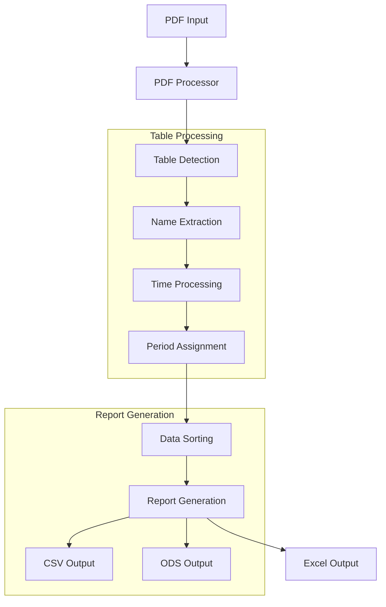

# System Patterns

## Architecture Overview
The system follows a modular architecture with these main components:

1. PDF Processing Module (✓ Implemented)
   - PDF to image conversion using pdf2image
   - Multi-page PDF handling
   - Table structure detection
   - Debug visualization system

2. Table Processing Module (✓ Implemented)
   - Name extraction and sorting
   - Time period assignment
   - Task code identification
   - Data combination across pages

3. Report Generation Module (✓ Implemented)
   - Period-based CSV generation
   - Template-based spreadsheet generation:
     - ODS format with odfpy
     - Excel format with openpyxl
   - Alphabetical name sorting
   - Time-based filtering
   - Multiple output formats

## Technical Decisions
Implemented approach:
1. PDF Processing:
   - Using pdfplumber for table extraction
   - Multi-page handling with page iteration
   - Table structure detection
   - Name column identification

2. Table Processing:
   - Time period boundaries:
     - Period 1: 6:00-6:45 PM
     - Period 2: 6:45-7:30 PM
     - Period 3: 7:30-8:15 PM
     - Period 4: 8:15-9:00 PM
     - Period 5: 9:00-9:45 PM
   - Name sorting:
     - Alphabetical by full name string
     - Preserves "last name, first name" format
   - Task code handling:
     - INI task detection
     - Time slot mapping
     - Period assignment

3. Report Generation:
   - Period-specific CSV files
   - Complete schedule CSV
   - Template-based workbooks (ODS and Excel):
     - Title and assignment time
     - Standard column headers
     - Room and task columns
     - Consistent formatting:
       - Cell borders and styles
       - Row heights
       - Column widths
   - Consistent column format:
     - Name
     - Task
     - Start Time
     - End Time

Planned enhancements:
1. Performance:
   - Memory optimization
   - Processing speed improvements
   - Special character handling

2. Analytics:
   - Worker statistics
   - Period utilization
   - Task distribution

## Design Patterns
Implemented patterns:
- Strategy Pattern: Table processing approaches
- Command Pattern: Processing pipeline steps
- Factory Pattern: CSV report generation
- Iterator Pattern: Multi-page processing
- Template Pattern: Period-based processing

Planned patterns:
- Observer Pattern: Performance monitoring
- Builder Pattern: Report customization
- Decorator Pattern: Data transformation

## Component Relationships

## System Flow
1. Input Phase (✓ Implemented):
   - Load PDF file
   - Detect number of pages
   - Initialize table processor

2. Processing Phase (✓ Implemented):
   - Extract tables from each page
   - Combine table data
   - Extract names and tasks
   - Assign time periods
   - Sort data alphabetically

3. Output Phase (✓ Implemented):
   - Generate period-specific CSVs
   - Sort names within periods
   - Create complete schedule
   - Generate ODS workbooks
   - Apply template formatting
   - Write formatted output

Note: This architecture document reflects both implemented features and planned enhancements. It will be updated as development progresses.
